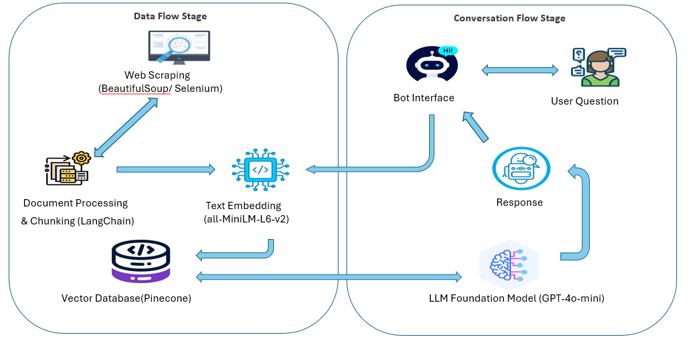

# Conversational AI Chatbot for UT Dallas JSOM  

## Introduction  
This project is a **Conversational AI Chatbot** built for the **UT Dallas Jindal School of Management (JSOM)**. The bot is designed to help **students, faculty, and staff** by answering frequently asked questions (FAQs) related to **admissions, programs, scholarships, and general school information**.  

Unlike simple FAQ pages, the chatbot can:  
- Provide **context-aware answers**  
- Retain **conversation flow**  
- Ask **clarifying questions** when queries are unclear  
- Expand beyond JSOM to broader **UT Dallas topics** when necessary  

---

## Tech Stack  

### Web Scraping  
- **BeautifulSoup**, **requests**, **Selenium** → for extracting information from JSOM webpages.  

### Data Cleaning & Preprocessing  
- **pandas** → for organizing and cleaning scraped data  
- **re (Regular Expressions)** → for text cleanup and formatting  

### Chunking & Embedding  
- **sentence-transformers (all-MiniLM-L6-v2)** → to generate embeddings (numerical meaning-based representations of text)  
- **Pinecone** → vector database for fast and semantic search  

### Conversational AI Layer  
- **OpenAI GPT-4o-mini** → for generating context-aware, natural responses  
- **Prompt Engineering** → to reduce hallucinations and guide conversations  

### User Interface  
- **Streamlit** → for building a simple, interactive, and shareable web application  

---

## Motivation  
I became curious and interested in learning more about **Large Language Models (LLMs)** after taking the **NLP course at UT Dallas**. During my exploration, I came across the concept of **Retrieval-Augmented Generation (RAG)**, which stood out as an exciting and practical approach to building smarter AI assistants. This project was my way of diving deeper into RAG, experimenting with how it works in practice, and applying it to a real-world use case at JSOM.  

---

## Overview  
The chatbot follows a **RAG (Retrieval-Augmented Generation)** workflow:  

1. **Scraping** → Collect content from JSOM web pages  
2. **Cleaning** → Standardize and preprocess the data  
3. **Chunking & Embedding** → Split into smaller pieces and generate embeddings  
4. **Storage** → Save embeddings in Pinecone for fast retrieval  
5. **Retrieval** → When a user asks a question, fetch the most relevant chunks  
6. **Generation** → Pass both the question and retrieved text to GPT-4o-mini for a contextual answer  
7. **Interaction** → Users chat via the Streamlit UI  

## [Live Demo](https://jsom-botship.streamlit.app/)  
---

## Key Learnings  

1. **Data quality matters.** We found that cleaner, well-prepared, and properly chunked text directly improved the accuracy and reliability of the chatbot’s responses.  

2. **Prompt design is powerful.** Even small adjustments in the way prompts were structured had a big impact on reducing vague or incorrect answers from the model.  

3. **Context retention is tricky.** Using overlapping chunks allowed the chatbot to better remember and carry over information from one part of the conversation to the next.  

4. **User experience is key.** A clear, friendly, and interactive UI made the chatbot far more approachable and encouraged people to actually use it.  

---

## Conclusion  
The **Conversational AI Chatbot for JSOM** is more than just a demo project. It shows how **Retrieval-Augmented Generation (RAG)** can make domain-specific knowledge **accessible, interactive, and scalable**.  

While this version is focused on UT Dallas JSOM, the same architecture can be applied to:  
- **Education:** Course assistants, FAQ bots for other schools  
- **Healthcare:** Patient support chatbots  
- **Corporate:** Internal HR/IT knowledge assistants  
- **Real Estate & Finance:** Smart advisors for clients
- **Business Intelligence:** It can help with interpreting data and giving overview of dashboards

